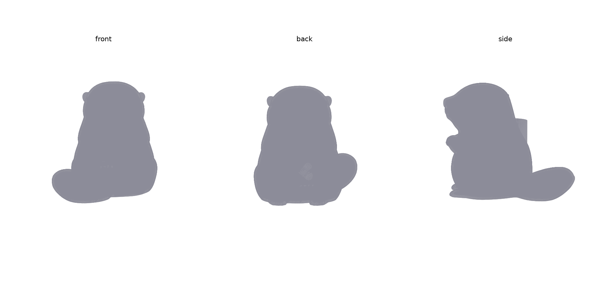
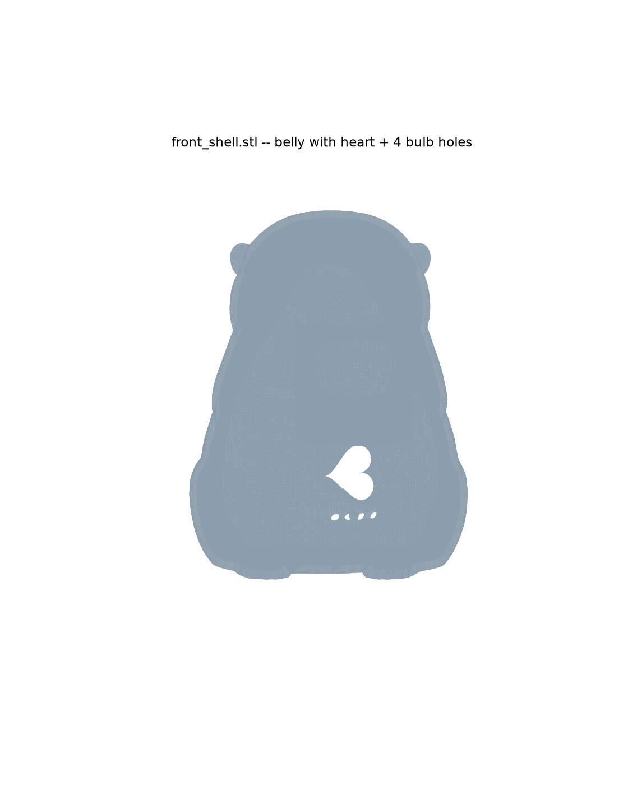

# Otter Mascot Toy — v1 (hollow shell, heart button, bulb row)

Built from the `OtterLEDH2S.3mf` sculpt you provided, scaled to 4.5" (114mm)
tall, hollowed for electronics, with a pressable heart button and 4x 3mm
bulb holes on the belly. This is a **fast first pass built under time
pressure** — see "What's simplified / not done" below before printing.

## Parts (3 STL)

| File | What it is |
|---|---|
| `stl/front_shell.stl` | Front half — face, belly, heart cutout, 4 bulb holes, hollow interior |
| `stl/back_shell.stl` | Back half — tail side, hollow interior, mates to the front via the clip |
| `stl/heart_cap.stl` | Separate raised, pressable heart button — insert into the heart cutout **from the inside** before closing the two halves |

## Assembly

1. Wire up your electronics (XIAO nRF52840, CR2032 + holder, switch, bulbs)
   loose/hand-fit inside the hollow cavity — there are no built-in mounts
   for them in this pass (see below). Route bulb leads out through the 4
   belly holes and glue/friction-fit the 3mm bulbs in place from outside.
2. Press the `heart_cap` into the heart-shaped opening **from the inside**
   of the front shell before closing the toy — its flange is wider than
   the hole so it can't be inserted from outside, but it seats in a
   shallow counterbore that lets it move ~0.8mm to press a switch you
   position behind it.
3. Close the two halves — 2 alignment dowels + 2 snap-bumps (top and
   bottom) hold them together, same clip mechanism as the earlier build.

## What's simplified / not done (given the deadline)

Per your call to skip standoffs for now and just get the shell + heart +
bulb holes working:

- **No XIAO/CR2032/switch-specific mounts** — the interior is just one
  large open cavity (~32×26×40mm at the widest). Components go in loose,
  hand-positioned/glued/taped. Tell me if you want mounts added once the
  shell itself is confirmed good.
- **No screwed battery door** — the only access is the front/back split
  itself.
- **Single colour split for now** — only the heart is a separate part
  (paintable/printable in a different colour from the shell). I didn't
  build additional colour regions (eyes/nose etc.) given the time
  constraint; say if you want that added.
- **A small cosmetic dent remains on the back** — the source mesh had a
  leftover cylindrical pocket from its original use as a tealight
  night-light (visible faintly on `back_shell.stl`, upper-back area). I
  didn't get a clean patch done under time pressure — it's hidden by the
  hollowing/split in most of its extent but may still show as a slight
  dimple. Cosmetic only, not structural.
- **STL watertightness**: the parts are watertight in-memory right after
  the boolean operations; re-loading the exported STL shows minor
  tessellation-precision seams (normal STL float32 round-trip artifact,
  same as the earlier owl build). Orca's auto-repair on import should
  clear this without issue.
- **Cavity fit was verified against a smoothed copy of the mesh** (to
  ignore the fur-texture noise when measuring wall thickness), targeting
  ≥2.5mm walls almost everywhere. One or two localised pinch points near
  the shoulder/paw crease may be thinner — worth a visual check in the
  slicer before printing.

## Regenerating / next steps

The working script isn't cleaned up into a single reusable file yet
(built interactively under time pressure) — ask and I'll consolidate it
into a proper parametric `build.py` like the owl version, which would
also make it straightforward to add the mounts/battery-door/more colours
back in once you're past tomorrow's deadline.
