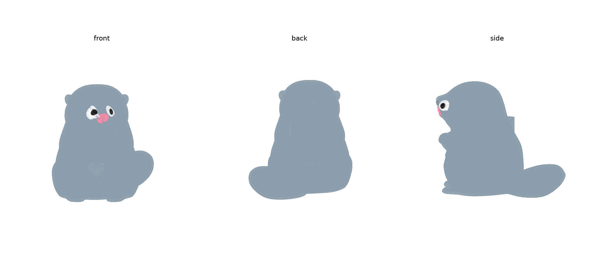
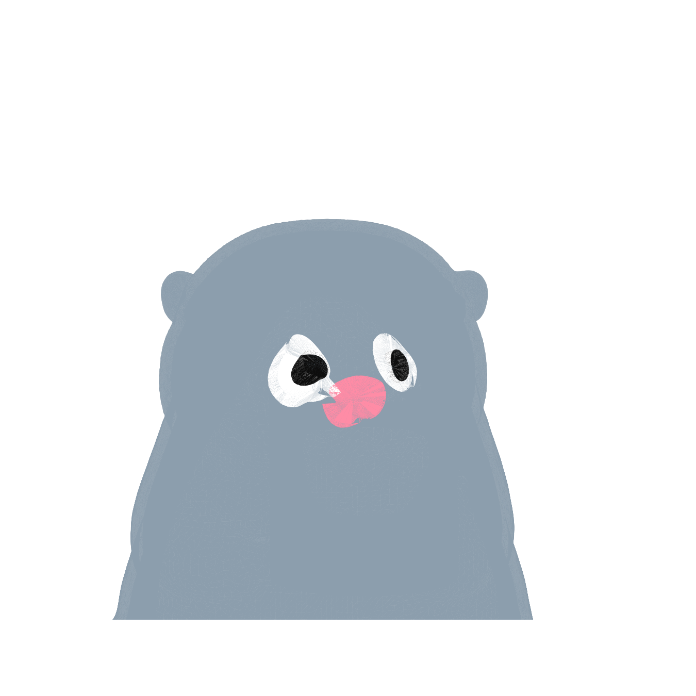

# Otter Mascot Toy — v5 (hollow shell, heart button, bulb row, face colours)

Built from the `OtterLEDH2S.3mf` sculpt you provided, scaled to 4.5" (114mm)
tall, hollowed for electronics, with a pressable heart button and 4x 3mm
bulb holes on the belly. This is a **fast build under time pressure** —
see "What's simplified / not done" below before printing.

## Colour parts (4 total, matching your ACE Pro's 4-slot budget)

| Slot | File(s) | Colour |
|---|---|---|
| 1 | `stl/front_shell.stl` + `stl/back_shell.stl` | body |
| 2 | `stl/heart_cap.stl` (hand-inserted, see Assembly) + `stl/nose_pink.stl` (fused, printed in place) | pink |
| 3 | `stl/eye_white.stl` | white |
| 4 | `stl/eye_black.stl` | black |

Nose, eye-white and eye-black are all fused into the shell during printing
(same mechanism as the body/heart-cutout — no post-print placement needed).
Only `heart_cap.stl` is a separate hand-inserted part, because it's the
one piece that has to physically move to act as a button. Whiskers were
discussed but left un-added — the geometry is too fine/thin for this
patch technique or reliable FDM colour resolution; paint them by hand if
you want them coloured.

## Revision history

- **v2**: heart made upright (lobes up, point down — was rotated 90° in
  v1), bulb holes centred as a group, snap-bump clip removed (dowels only).
- **v3→v4**: heart re-centred on the body's *actual* silhouette centreline
  (X≈-8mm, not X=0 — the sculpted pose itself isn't perfectly symmetric,
  confirmed by raycasting the outer surface), bulb hole spacing widened
  from a 4mm to a 7mm pitch (was leaving only ~1mm of material between
  holes, now ~4mm), and the leftover tealight-candle cavity on the back
  is patched smooth on the *outside* and turned into a flat internal
  mounting platform/shelf on the *inside*, reachable from the main
  cavity. v3 had a build bug where that platform punched straight
  through the outer surface (visible rectangular block on the side) —
  fixed in v4 by re-clipping everything against the true exterior
  surface after adding it.
  **Known remaining issue**: a small cosmetic step is still faintly
  visible on the side profile near the shoulder, from the same patched
  area — much smaller than the v3 defect but not fully smoothed out.
  Flag if it's visible enough to bother you and I'll take another pass.
- **v5**: added eye-white, pupil-black, and nose-pink (shares the
  heart's pink) as fused colour patches on the face, using the same
  flush-patch technique as the heart/nose. Eye/nose placement was found
  by sampling the actual sculpted indents/bump rather than assuming a
  fixed offset — reasonably close but not laser-precise; check the face
  preview image and flag if either eye needs nudging.

## Parts (3 STL)

| File | What it is |
|---|---|
| `stl/front_shell.stl` | Front half — face, belly, heart cutout, 4 bulb holes, hollow interior |
| `stl/back_shell.stl` | Back half — tail side, hollow interior, mates to the front via the clip |
| `stl/heart_cap.stl` | Separate raised, pressable heart button — insert into the heart cutout **from the inside** before closing the two halves |

## Assembly

1. Wire up your electronics (XIAO nRF52840, CR2032 + holder, switch, bulbs)
   loose/hand-fit inside the hollow cavity — there are no built-in mounts
   for them in this pass (see below). Route bulb leads out through the 4
   belly holes and glue/friction-fit the 3mm bulbs in place from outside.
2. Press the `heart_cap` into the heart-shaped opening **from the inside**
   of the front shell before closing the toy — its flange is wider than
   the hole so it can't be inserted from outside, but it seats in a
   shallow counterbore that lets it move ~0.8mm to press a switch you
   position behind it.
3. Close the two halves — 2 alignment dowels hold them in register
   (left/right, near the shoulder height). With the snap-bumps removed
   there's no positive click-shut retention anymore, just the dowels'
   friction fit — plan on a dab of glue or tape at the seam to keep it
   closed, or ask if you want a different closure mechanism added back
   (e.g. bumps recessed so they don't show externally, or screws).

## What's simplified / not done (given the deadline)

Per your call to skip standoffs for now and just get the shell + heart +
bulb holes working:

- **No XIAO/CR2032/switch-specific mounts** — the interior is just one
  large open cavity (~32×26×40mm at the widest). Components go in loose,
  hand-positioned/glued/taped. Tell me if you want mounts added once the
  shell itself is confirmed good.
- **No screwed battery door** — the only access is the front/back split
  itself.
- **Single colour split for now** — only the heart is a separate part
  (paintable/printable in a different colour from the shell). I didn't
  build additional colour regions (eyes/nose etc.) given the time
  constraint; say if you want that added.
- **A small cosmetic dent remains on the back** — the source mesh had a
  leftover cylindrical pocket from its original use as a tealight
  night-light (visible faintly on `back_shell.stl`, upper-back area). I
  didn't get a clean patch done under time pressure — it's hidden by the
  hollowing/split in most of its extent but may still show as a slight
  dimple. Cosmetic only, not structural.
- **STL watertightness**: the parts are watertight in-memory right after
  the boolean operations; re-loading the exported STL shows minor
  tessellation-precision seams (normal STL float32 round-trip artifact,
  same as the earlier owl build). Orca's auto-repair on import should
  clear this without issue.
- **Cavity fit was verified against a smoothed copy of the mesh** (to
  ignore the fur-texture noise when measuring wall thickness), targeting
  ≥2.5mm walls almost everywhere. One or two localised pinch points near
  the shoulder/paw crease may be thinner — worth a visual check in the
  slicer before printing.

## Regenerating / next steps

The working script isn't cleaned up into a single reusable file yet
(built interactively under time pressure) — ask and I'll consolidate it
into a proper parametric `build.py` like the owl version, which would
also make it straightforward to add the mounts/battery-door/more colours
back in once you're past tomorrow's deadline.
