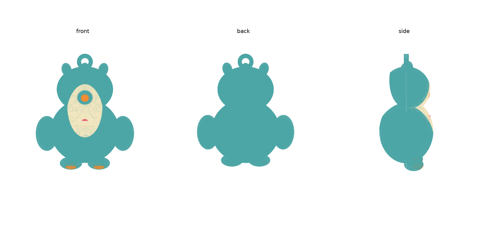

# Shield Owl Mascot Toy — 3D Print Files

Parametric CAD (CadQuery/Python) for the Shield companion keyring toy,
built from `VCX_mascot_component_sheet.pdf` and `VCX_mascot_toy_concept.pdf`
(rev B, 4-window charge bar), styled as the site's owl mascot.



## Architecture

Single printed owl body, split **front / back** and joined by a snap clip
(2 spherical snap-bumps + 2 alignment dowels), so the whole thing can be
opened for assembly/repair. A separate small **battery door** (2 screws)
gives routine CR2032 access without popping the main clip.

This assumes the "swappable character shell" note in the concept sheet is
about the product line (same electronics, different animal shells) rather
than a second physical layer the owner swaps at home — **not yet confirmed
with the requester**. If a true two-layer core+shell system is wanted
instead, the interior standoffs need to move onto a separate inner capsule
and the shell becomes a thin decorative skin over it — flag before printing
if that's the actual intent.

## Parts (6 STL/STEP, one per print colour)

| File | Colour | Contents |
|---|---|---|
| `back_teal` | body colour | back shell half, XIAO rails, CR2032 holder mount, battery door opening + screw bosses, snap-bump clips, dowel pins |
| `front_teal` | body colour | front shell half, tummy button boss, LED light-pipe channels, piezo mount + sound slits, dowel/bump cutouts |
| `cream_face` | face/chest accent | face + chest patch, recessed flush into the front shell, with a hole for the beak |
| `orange_beak_feet` | beak/feet accent | beak (sits in the cream patch's hole) + 2 foot-tip accents |
| `heart_accent` | 4th accent colour | chest heart, doubles as the physical button cap over the tummy switch |
| `battery_door_teal` | body colour | small screwed panel covering the CR2032 access hole |

Import all 6 into Orca Slicer as separate objects and assign each to its own
filament/AMS-ACE-Pro slot — that gives the single-print auto colour-switch
job you asked for. `front_teal`/`back_teal`/`battery_door_teal` can share
one slot since they're the same colour.

## Electronics layout

- **XIAO nRF52840** (21 × 17.8mm): mounted vertically against the inside of
  the back wall on 2 printed rails + a bottom stop, closed off by a
  matching boss on the front half. USB-C faces the battery-door opening
  per the wiring sheet, for reflashing without a separate cutout.
- **CR2032 + holder**: sits in a shallow registration lip on the back wall,
  upper-body/head-junction area, accessed through the round door opening.
- **Tummy button**: tactile switch boss on the front wall; the printed
  heart is the physical cap the child presses.
- **4x LED charge bar**: 4 small through-holes in a row below the heart.
  Printed shell plastic will *not* transmit LED light usefully at this
  wall thickness — these are sized (2.4mm) for a short length of clear
  acrylic rod glued in as a light pipe, not an open/bare LED.
- **Piezo (12mm)**: boss on the lower front wall, vented through 3 sound
  slits.

## PLACEHOLDER values — confirm before final print

Everything below is a reasonable assumption, not a confirmed spec. Edit
`params.py` and re-run `python3 build.py` once you have the real numbers —
nothing else needs to change.

- **CR2032 holder** exact model/footprint (`HOLDER_L/W/T` currently assume
  a generic ~21.5×21.5×5.6mm clip holder — this is the single most
  fit-critical unknown; different holders vary a lot in shape).
- **XIAO clearance height** (`XIAO_T`) — assumed 4.5mm to clear the USB-C
  connector; confirm against your actual board/antenna.
- **Tactile switch** dimensions (`BUTTON_D/H`, `BUTTON_CAP_D`) — generic
  6mm switch assumed.
- **LED** lens diameter / light-pipe approach (`LED_D`, `LED_PIPE_D`).
- **Piezo** thickness (`PIEZO_T`).
- Screw size for the battery door (`DOOR_SCREW_D`, currently ~M2/#2 self-tap
  pilot).

## Sizing note

The concept sheet targets "~45-55mm tall." A strict 50mm shell left under
1mm clearance around the XIAO + coin-cell holder + button/LED/piezo stack
in several places — too tight to reliably print and assemble. This build
is sized to the top of that range instead (finished body ~56-58mm,
~62mm including the keyring loop). Flag if 50mm exactly is a hard
requirement (e.g. must match another part) — it's a real trade-off, not
an oversight.

## STL export note

The STL exports carry minor tessellation seams typical of complex CAD
boolean output (confirmed: the underlying CAD solids pass OCC's strict
topology validity check — this is an export/meshing artifact, not a
design defect). Orca Slicer's auto mesh-repair on import handles this in
the overwhelming majority of cases. If a part still looks broken after
slicing, re-export via the STEP files in `step/` (exact BREP, no
tessellation ambiguity) through a mesh-repair tool, or ask for a
re-tessellation pass.

## Regenerating

```
pip3 install cadquery
python3 build.py
```
Outputs land in `out/`. Edit `params.py` for any dimension change — the
whole model (cavities, standoffs, colour patches, split, clip) rebuilds
from those constants.
